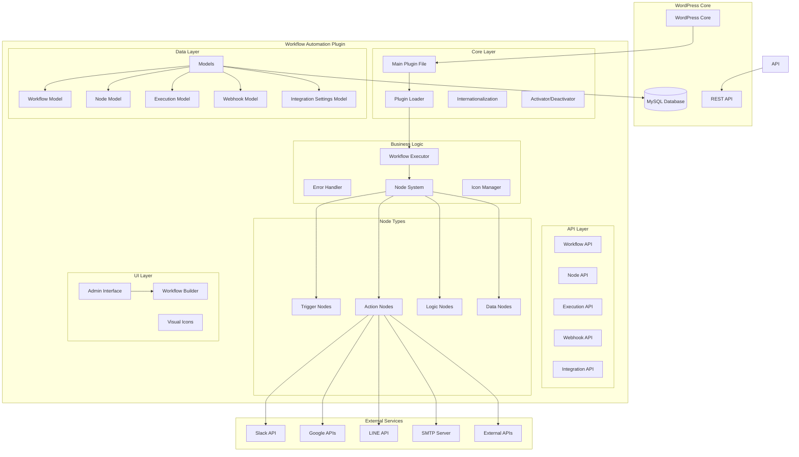
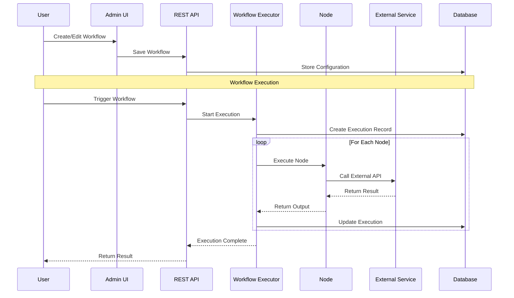
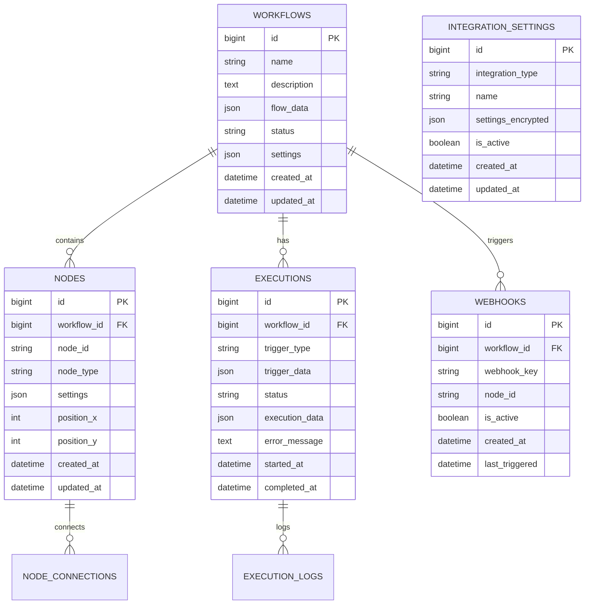
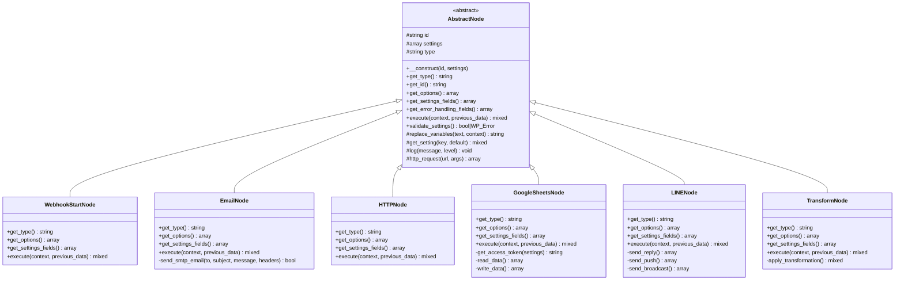

# Workflow Automation Plugin Architecture

## System Architecture Overview



## Data Flow Architecture



## Database Schema



## Node Architecture



## Component Responsibilities

### Core Components

1. **Plugin Loader** (`class-workflow-automation-loader.php`)
   - Manages all WordPress hooks and filters
   - Coordinates plugin initialization

2. **Workflow Executor** (`class-workflow-executor.php`)
   - Executes workflows from start to finish
   - Manages execution context
   - Handles node connections and flow

3. **Error Handler** (`class-workflow-error-handler.php`)
   - Implements retry logic with backoff strategies
   - Classifies errors and determines retryability
   - Logs errors to database
   - Sends notifications on failures

### API Layer

1. **Workflow API** (`class-workflow-api.php`)
   - CRUD operations for workflows
   - Workflow execution triggers

2. **Node API** (`class-node-api.php`)
   - Provides node type information
   - Node validation endpoints

3. **Integration API** (`class-integration-api.php`)
   - Manages integration configurations
   - Tests integration connections

### Node System

1. **Abstract Node** (`abstract-node.php`)
   - Base class for all nodes
   - Common functionality (variable replacement, logging)
   - Error handling fields

2. **Node Types**
   - **Triggers**: Webhook Start
   - **Actions**: Email, Slack, HTTP, Google Sheets, LINE
   - **Logic**: Filter, Loop
   - **Data**: Transform, Format, Parse

### Security Features

1. **Data Encryption**
   - Sensitive integration settings encrypted using WordPress salts
   - AES-256-CBC encryption for API keys and tokens

2. **Permission Checks**
   - All API endpoints require `manage_options` capability
   - Nonce verification for forms

3. **Input Validation**
   - All user inputs sanitized
   - JSON validation for structured data

## Deployment Architecture

```
WordPress Installation
├── wp-content/
│   └── plugins/
│       └── workflow-automation/
│           ├── Plugin files
│           └── Assets
└── wp-admin/
    └── Workflow Automation Menu
```

## Performance Considerations

1. **Asynchronous Execution**
   - Workflows scheduled via WordPress cron
   - Non-blocking execution

2. **Database Optimization**
   - Indexed columns for fast lookups
   - Cleanup of old execution records

3. **Error Recovery**
   - Automatic retry with exponential backoff
   - Graceful degradation on failures

## Future Architecture Enhancements

1. **Scalability**
   - Queue system for high-volume workflows
   - Distributed execution support

2. **Monitoring**
   - Real-time execution tracking
   - Performance metrics dashboard

3. **Advanced Features**
   - Workflow versioning
   - A/B testing capabilities
   - Advanced analytics